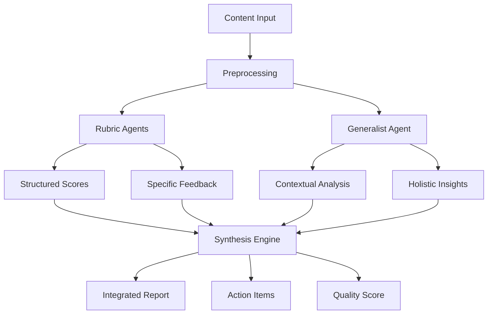

# Hybrid Rubric-Generalist System Architecture

## Table of Contents
1. [System Overview](#system-overview)
2. [Dual-Agent Architecture](#dual-agent-architecture)
3. [Workflow Patterns](#workflow-patterns)
4. [Implementation Strategy](#implementation-strategy)
5. [Technical Requirements](#technical-requirements)
6. [Performance Metrics](#performance-metrics)
7. [Future Considerations](#future-considerations)

## System Overview

### Core Concept
The Hybrid Rubric-Generalist System represents an innovative approach to educational content evaluation that combines the structured precision of rubric-based assessment with the adaptive intelligence of generalist AI agents. This architecture addresses the fundamental challenge of balancing systematic evaluation with contextual understanding.

### Key Principles
- **Complementary Intelligence**: Leveraging strengths of both specialized and general evaluation approaches
- **Scalable Quality Assurance**: Enabling comprehensive review without sacrificing depth
- **Adaptive Feedback**: Providing both structured metrics and nuanced recommendations
- **Continuous Improvement**: Learning from evaluation patterns to refine both rubrics and generalist responses

## Dual-Agent Architecture

### Agent Types

#### 1. Rubric Specialist Agents
**Purpose**: Systematic evaluation against defined criteria

**Characteristics**:
- Highly structured evaluation process
- Consistent scoring across content
- Quantifiable metrics generation
- Objective assessment framework

**Components**:
```
RubricAgent {
  rubricDefinition: RubricTemplate
  scoringAlgorithm: ScoringFunction
  evidenceCollector: EvidenceMapper
  reportGenerator: ReportBuilder
}
```

**Responsibilities**:
- Score content against specific rubric criteria
- Identify evidence for scores
- Generate structured feedback
- Produce quantitative metrics

#### 2. Generalist Evaluation Agents
**Purpose**: Holistic assessment and contextual understanding

**Characteristics**:
- Flexible evaluation approach
- Context-aware analysis
- Creative problem identification
- Nuanced recommendation generation

**Components**:
```
GeneralistAgent {
  contextAnalyzer: ContextEngine
  patternRecognizer: PatternMatcher
  recommendationEngine: SuggestionBuilder
  synthesizer: InsightGenerator
}
```

**Responsibilities**:
- Identify issues beyond rubric scope
- Provide contextual recommendations
- Synthesize cross-cutting concerns
- Generate strategic improvement suggestions

### Agent Interaction Model



## Workflow Patterns

### Pattern 1: Sequential Processing
**Use Case**: When rubric evaluation should inform generalist analysis

```
1. Content Submission
2. Rubric Agent Evaluation
   - Generate scores
   - Identify weak areas
3. Generalist Agent Focus
   - Deep dive on problem areas
   - Contextual recommendations
4. Integrated Reporting
```

**Advantages**:
- Efficient resource use
- Targeted generalist analysis
- Clear evaluation progression

### Pattern 2: Parallel Processing
**Use Case**: When independent perspectives are valuable

```
1. Content Submission
2. Simultaneous Processing
   - Rubric agents evaluate
   - Generalist analyzes independently
3. Cross-Validation
   - Compare findings
   - Identify agreements/conflicts
4. Unified Synthesis
```

**Advantages**:
- Faster total processing time
- Independent validation
- Richer perspective diversity

### Pattern 3: Iterative Refinement
**Use Case**: For high-stakes content requiring thorough review

```
1. Initial Rubric Assessment
2. Generalist Review
3. Targeted Re-evaluation
   - Focus on disputed areas
   - Deep analysis of edge cases
4. Final Consensus Building
5. Comprehensive Report Generation
```

**Advantages**:
- Highest accuracy
- Thorough edge case handling
- Consensus-driven scoring

## Implementation Strategy

### Phase 1: Foundation (Weeks 1-4)
**Objectives**:
- Establish rubric frameworks
- Define agent interfaces
- Create basic workflow engine

**Deliverables**:
- Core rubric definitions (10 rubrics)
- Agent API specifications
- Basic workflow orchestrator

### Phase 2: Integration (Weeks 5-8)
**Objectives**:
- Implement agent communication
- Build synthesis engine
- Create reporting system

**Deliverables**:
- Inter-agent messaging system
- Report generation templates
- Quality scoring algorithm

### Phase 3: Optimization (Weeks 9-12)
**Objectives**:
- Performance tuning
- Workflow optimization
- User interface development

**Deliverables**:
- Optimized processing pipeline
- Web-based review interface
- Performance benchmarks

### Phase 4: Validation (Weeks 13-16)
**Objectives**:
- System testing
- User acceptance testing
- Production preparation

**Deliverables**:
- Test results documentation
- User feedback integration
- Production deployment plan

## Technical Requirements

### Infrastructure

#### Compute Resources
- **Rubric Agents**: Low compute, high parallelization
  - CPU: 2 cores per agent
  - Memory: 4GB per agent
  - Storage: 10GB shared cache

- **Generalist Agents**: High compute, GPU-optimized
  - GPU: NVIDIA A100 or equivalent
  - Memory: 32GB minimum
  - Storage: 100GB for model and context

#### Software Stack
```yaml
Core Platform:
  - Python 3.10+
  - FastAPI for API layer
  - Celery for task orchestration
  - Redis for message queuing

AI/ML Components:
  - PyTorch/TensorFlow for model serving
  - LangChain for agent orchestration
  - OpenAI/Anthropic APIs for LLM access
  - Custom rubric evaluation engine

Data Layer:
  - PostgreSQL for structured data
  - MongoDB for document storage
  - S3-compatible object storage
  - Elasticsearch for search/analytics
```

### API Architecture

#### External APIs
```python
# Content Submission API
POST /api/v1/content/submit
{
  "content_id": "uuid",
  "content_type": "lesson|assessment|course",
  "content_data": {...},
  "evaluation_profile": "standard|thorough|quick"
}

# Results Retrieval API
GET /api/v1/results/{content_id}
{
  "rubric_scores": {...},
  "generalist_insights": {...},
  "integrated_report": {...},
  "action_items": [...]
}
```

#### Internal Agent APIs
```python
# Rubric Agent Interface
class RubricAgentAPI:
    def evaluate(content: Content) -> RubricScore
    def get_evidence(score: RubricScore) -> Evidence
    def generate_feedback(score: RubricScore) -> Feedback

# Generalist Agent Interface
class GeneralistAgentAPI:
    def analyze(content: Content, context: Context) -> Analysis
    def recommend(analysis: Analysis) -> Recommendations
    def synthesize(inputs: List[Input]) -> Synthesis
```

## Performance Metrics

### System Performance KPIs

#### Throughput Metrics
- **Documents/Hour**: Target 100+ for standard evaluation
- **Parallel Processing**: Support 50+ simultaneous evaluations
- **Queue Time**: < 30 seconds average wait

#### Quality Metrics
- **Inter-rater Reliability**: > 0.85 correlation with human experts
- **False Positive Rate**: < 5% for critical issues
- **Coverage**: 95% of rubric criteria evaluated

#### Efficiency Metrics
- **Cost per Evaluation**: < $0.50 for standard document
- **Processing Time**: < 5 minutes for complete evaluation
- **Resource Utilization**: > 70% average GPU utilization

### Evaluation Quality Metrics

#### Rubric Agent Metrics
- Scoring consistency: Standard deviation < 0.5
- Evidence quality: > 90% relevant citations
- Criterion coverage: 100% attempted evaluation

#### Generalist Agent Metrics
- Insight relevance: > 80% actionable findings
- Recommendation quality: > 75% user acceptance
- Context accuracy: > 90% appropriate analysis

## Future Considerations

### Scalability Enhancements

#### Horizontal Scaling
- Kubernetes-based orchestration
- Auto-scaling based on queue depth
- Regional deployment for global coverage

#### Vertical Optimization
- Model quantization for efficiency
- Caching strategies for repeated content
- Batch processing optimization

### Advanced Features

#### Learning and Adaptation
- Feedback loop integration
- Rubric refinement based on outcomes
- Personalized evaluation profiles

#### Extended Capabilities
- Multi-modal content evaluation (video, audio)
- Real-time collaborative review
- Predictive quality scoring

#### Integration Opportunities
- LMS platform plugins
- Content authoring tool integration
- Automated content improvement workflows

### Research Directions

#### Hybrid Intelligence Research
- Optimal agent collaboration patterns
- Conflict resolution strategies
- Emergent quality indicators

#### Evaluation Science
- New rubric development methodology
- Cross-domain evaluation transfer
- Bias detection and mitigation

## Conclusion

The Hybrid Rubric-Generalist System represents a significant advancement in educational content evaluation, combining the best of structured assessment with adaptive intelligence. By implementing this architecture, organizations can achieve:

1. **Consistent Quality**: Standardized evaluation across all content
2. **Contextual Understanding**: Nuanced feedback beyond rigid criteria
3. **Scalable Operations**: Efficient processing of large content volumes
4. **Continuous Improvement**: Learning from evaluation patterns

The system's modular design ensures flexibility for future enhancements while maintaining robust performance for current needs. As educational content continues to evolve, this hybrid approach provides the foundation for maintaining and improving quality at scale.