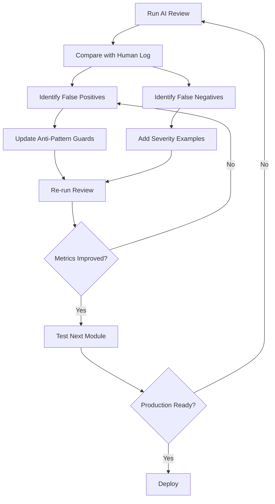

# Layered Master Prompt System Implementation Plan

> **For Claude:** REQUIRED SUB-SKILL: Use superpowers:executing-plans to implement this plan task-by-task.

**Goal:** Improve AI review quality by creating a 3-layer prompt architecture with exemplar grounding, specificity enforcement, and severity calibration.

**Architecture:** Layer 1 (Master Guardrail Prompt) enforces specificity requirements, content structure clarifications, and anti-pattern guards. Layer 2 (Domain Prompts) provides authoring and style rules. Layer 3 (Rubric Prompts) evaluates specific competencies with calibrated severity examples.

**Tech Stack:** XML rubrics, text-based prompts, Python analysis scripts, Anthropic Claude Sonnet API

**Key Constraint:** AI reviewers do NOT evaluate images, animations, or visual elements - those are handled by separate model/reviewer.

---

## Task 1: Create Master Review Context Prompt

**Files:**
- Create: `config/prompts/master_review_context.txt`

**Step 1: Create master prompt file with guardrails**

Create `config/prompts/master_review_context.txt`:

```markdown
# Master Review Context - AI Content Reviewer Guardrails

## YOUR ROLE
You are an AI content reviewer for educational calculus modules. Your job is to provide SPECIFIC, ACTIONABLE feedback that helps authors improve content for struggling students studying alone at home.

## CRITICAL: OUT OF SCOPE

**DO NOT REVIEW:**
- Images, graphics, or visual elements
- Animated figures or animations
- Static figures or diagrams
- Scene transitions or animation quality
- Visual design or layout

**These elements are reviewed by a separate specialized model.**

**ONLY REVIEW:**
- Text content (framing text, captions, definitions)
- Question stems and hints
- Pedagogical structure and flow
- Writing style and mechanics
- Mathematical notation and LaTeX

## CRITICAL: CONTENT STRUCTURE FACTS

**Understanding Module Structure:**
- Modules REFERENCE learning outcomes (LOs) via `<LearningOutcomes ids="X.Y.Z"/>` tags
- Modules do NOT define learning outcomes - LOs are defined elsewhere in course structure
- A module with `<LearningOutcomes ids="5.5.1,5.5.2"/>` is CORRECT and COMPLETE
- **DO NOT FLAG**: "Missing learning objective definitions" or similar - this is incorrect

**Understanding Lesson Structure:**
Core lessons contain:
- Framing text (100-150 words) with key definitions
- Animated figure (2-3 min, 3-5 scenes) - **DO NOT REVIEW**
- Follow-up questions (5-10 questions)
- Brief summary (few bullet points)

**Understanding Assessment Structure:**
- Lessons contain learning questions (quick checks, not homework)
- Homework questions are separate from lessons
- Quiz questions are separate from homework
- **DO NOT FLAG**: "Missing homework problems in lesson" - lessons are NOT homework

## MANDATORY SPECIFICITY REQUIREMENTS

**Every issue you flag MUST include ALL FOUR components:**

1. **Line number(s)** - Exact location(s) where issue occurs
2. **Quoted excerpt** - The actual problematic text (verbatim)
3. **Student impact** - How does this hurt the struggling student at home with low confidence?
4. **Concrete suggestion** - Specific wording/structure to fix it (not vague advice)

**Example of COMPLIANT issue:**
```
Line 47: "What's the derivative of f(x) = x²?"
Issue: Uses contraction "What's" (should be "What is")
Student Impact: Violates style consistency; may confuse ESL students
Suggestion: Change to "What is the derivative of f(x) = x²?"
Severity: 2
```

**Examples of NON-COMPLIANT issues (NEVER submit these):**
```
❌ "Some sentences are very long"
   Missing: line numbers, quoted text, specific suggestion

❌ "Could use more examples"
   Missing: where? which concept? what kind of examples?

❌ "Pacing feels off"
   Missing: everything - this is pure opinion without evidence

❌ "The scaffolding could be improved"
   Missing: which concept? what's the jump? what's the fix?

❌ "The animation is too fast"
   Out of scope: animations are reviewed separately
```

**If you cannot provide all 4 components, DO NOT FLAG THE ISSUE.**

## CHAIN-OF-THOUGHT REQUIREMENT

Before assigning ANY severity level, you MUST:
1. Quote the specific text (with line number)
2. Explain WHY it violates the rule (cite specific guideline)
3. Explain the student impact (how does this harm learning?)
4. Propose the concrete fix (exact wording or structure)
5. THEN and ONLY THEN assign severity based on impact magnitude

**Do not make intuitive severity judgments. Follow the chain above.**

## SEVERITY CALIBRATION GUIDANCE

**Severity 5 (Critical - Block Publication):**
Use ONLY when content is fundamentally broken and would actively mislead or confuse students:
- Mathematically incorrect statements
- Missing essential scaffolding that makes content incomprehensible
- Contradictions within the module
- Security/accessibility violations

**Severity 4 (Major - Must Fix Before Publication):**
Use when content has significant pedagogical or structural problems:
- Large conceptual jumps without scaffolding
- Missing critical practice opportunities
- Consistently violating style rules (3+ instances of same error)
- Confusing or ambiguous definitions

**Severity 3 (Moderate - Should Fix):**
Use for moderate issues that reduce content quality:
- Inconsistent terminology within module
- Insufficient examples for complex concepts
- Missing serial commas or other clarity-reducing style issues
- Some scaffolding gaps

**Severity 2 (Minor - Polish):**
Use for small issues that don't significantly impact learning:
- Single instance of style violation
- Could use slightly better wording
- Minor formatting inconsistencies

**Severity 1 (Trivial - Nice-to-Have):**
Use for pure polish and optional enhancements:
- Could add optional enrichment activity
- Minor style preferences
- Aesthetic improvements (text only)

**When in doubt between two severities, choose the LOWER one.**

## ANTI-PATTERN GUARDS: DO NOT FLAG THESE

The following are CORRECT patterns in our content. **DO NOT flag these as issues:**

**Out of Scope (NEVER REVIEW):**
- ❌ Image quality, diagram clarity, visual design
- ❌ Animation pacing, scene transitions, visual effects
- ❌ Figure labels or visual annotations
- ❌ Color choices or visual aesthetics
- ❌ Graph formatting or visual presentation

**Structural Patterns (CORRECT):**
- ✅ Modules that reference LOs via `<LearningOutcomes ids="..."/>` tags
- ✅ Modules that don't define LOs (they reference them from elsewhere)
- ✅ Lessons without homework problems (homework is separate)
- ✅ Short lessons (5-10 minutes is intentional for chunking)
- ✅ Animated figures with 3-5 scenes (this is our standard)

**Style Guide Compliance (CORRECT):**
- ✅ Using "Ex:" instead of "e.g." (this is our style)
- ✅ Using "specifically" or "that is" instead of "i.e." (this is our style)
- ✅ Using "so" instead of "therefore/thus/hence" (this is our style)
- ✅ Possessives like "function's derivative" or "square's area" (NOT contractions)
- ✅ Mathematical directional language: "left-hand limit", "right-hand side of equation"

**Pedagogical Patterns (CORRECT):**
- ✅ Starting with simple examples (x²) before complex ones (3x² + 2x + 1)
- ✅ Framing text of 100-150 words (this is our target range)
- ✅ 5-10 follow-up questions per lesson (this is our target)
- ✅ Bite-sized activities (~10 minutes each)
- ✅ Modules of ~50 minutes total duration

**Assessment Patterns (CORRECT):**
- ✅ Multiple choice with 3 choices (2 distractors is intentional)
- ✅ Multiple choice with 4 choices (3 distractors for richer misconceptions)
- ✅ Short answer questions requiring single precise answer
- ✅ Hints that lead students rather than just saying "review section X"
- ✅ Explanations for all MC choices (including correct answer)

**If you see these patterns, they are CORRECT. Do not flag them.**

## CONFIDENCE SCORING

Rate your confidence (0.0-1.0) based on:
- **1.0**: Unambiguous violation with clear guideline citation
- **0.8**: Clear violation with minor interpretation needed
- **0.6**: Violation present but guideline allows some flexibility
- **0.4**: Uncertain if this violates guidelines
- **0.2**: Mostly opinion-based

**If your confidence is below 0.6, DO NOT FLAG THE ISSUE.**

## REVIEW WORKFLOW

For each review:
1. Read the ENTIRE module first (don't flag as you read)
2. Skip all image/animation elements (out of scope)
3. Identify patterns of issues (not isolated instances)
4. For each potential issue, ask: "Can I provide line number, quote, student impact, and concrete fix?"
5. If NO to above, discard the issue
6. If YES to above, apply chain-of-thought to determine severity
7. Double-check against anti-pattern guards
8. Only then submit the issue

## REMEMBER

Your goal is to help AUTHORS, not to demonstrate your reviewing skills. Quality over quantity. Ten specific, actionable issues are worth more than fifty vague observations.

**When in doubt, DO NOT FLAG.**
```

**Step 2: Verify file was created**

Run: `ls -lh config/prompts/master_review_context.txt`

Expected: File exists, ~10-12 KB

**Step 3: Commit**

```bash
git add config/prompts/master_review_context.txt
git commit -m "feat: add master review context prompt with guardrails

- Content structure clarifications (LO references, lesson structure)
- Mandatory specificity requirements (line #, quote, impact, fix)
- Chain-of-thought severity assignment
- Severity calibration guidance (1-5 scale)
- Anti-pattern guards for correct patterns
- Confidence scoring guidelines
- CRITICAL: Excludes images/animations from review scope"
```

---

## Task 2: Analyze Review Logs for Pattern Extraction

**Files:**
- Create: `scripts/analyze_review_logs.py`
- Read: `modules/Chapter 5 Review Log - 5.6 Beta.csv`
- Read: `modules/Chapter 5 Review Log - 5.6 CE + Other.csv`
- Read: `modules/Chapter 5 Review Log - 5.7 Beta.csv`
- Read: `modules/Chapter 5 Review Log - 5.7 CE + Other.csv`
- Create: `docs/review_log_analysis.md`

**Step 1: Inspect CSV structure first**

Run: `head -n 3 "modules/Chapter 5 Review Log - 5.6 Beta.csv"`

Expected: CSV headers and first 2 rows to understand column names

**Step 2: Create analysis script based on actual CSV structure**

Create `scripts/analyze_review_logs.py`:

```python
#!/usr/bin/env python3
"""
Analyze review logs to extract patterns for prompt improvement.

Extracts:
- Good catches (correctly identified issues)
- False positives (incorrectly flagged non-issues)
- Severity calibration examples (what's actually severity 5 vs 3 vs 1)
- Visual/animation issues to exclude from text review scope
"""

import csv
import sys
from pathlib import Path
from collections import defaultdict


def analyze_review_log(csv_path):
    """Analyze a single review log CSV file."""
    good_catches = []
    false_positives = []
    severity_examples = defaultdict(list)
    visual_issues = []

    try:
        with open(csv_path, 'r', encoding='utf-8') as f:
            # Try to detect delimiter
            sample = f.read(1024)
            f.seek(0)

            reader = csv.DictReader(f)
            headers = reader.fieldnames

            print(f"  Headers: {headers}")

            for row in reader:
                # Extract key fields (adjust based on actual CSV structure)
                # Common column names: Issue, Severity, Status, Notes, Type, Category
                issue = row.get('Issue', row.get('issue', '')).strip()
                severity = row.get('Severity', row.get('severity', row.get('Priority', ''))).strip()
                status = row.get('Status', row.get('status', '')).strip()
                notes = row.get('Notes', row.get('notes', '')).strip()
                category = row.get('Category', row.get('Type', '')).strip().lower()

                if not issue:
                    continue

                # Identify visual/animation issues
                if any(keyword in issue.lower() for keyword in
                       ['animation', 'figure', 'image', 'visual', 'diagram', 'graph', 'scene']):
                    visual_issues.append({
                        'issue': issue,
                        'severity': severity,
                        'notes': notes
                    })
                    continue  # Skip visual issues for text review patterns

                # Classify based on status
                if status.lower() in ['valid', 'fixed', 'accepted', 'done', 'completed']:
                    good_catches.append({
                        'issue': issue,
                        'severity': severity,
                        'notes': notes
                    })
                    severity_examples[severity].append({
                        'issue': issue,
                        'status': 'valid',
                        'notes': notes
                    })
                elif status.lower() in ['invalid', 'rejected', 'not an issue', 'n/a', 'wontfix']:
                    false_positives.append({
                        'issue': issue,
                        'severity': severity,
                        'notes': notes
                    })

    except Exception as e:
        print(f"  Error reading {csv_path}: {e}")
        return None

    return {
        'good_catches': good_catches,
        'false_positives': false_positives,
        'severity_examples': severity_examples,
        'visual_issues': visual_issues
    }


def generate_report(all_results, output_path):
    """Generate markdown report from analysis results."""

    # Combine all results
    all_good = []
    all_false_pos = []
    all_severity = defaultdict(list)
    all_visual = []

    for result in all_results:
        if result is None:
            continue
        all_good.extend(result['good_catches'])
        all_false_pos.extend(result['false_positives'])
        for sev, examples in result['severity_examples'].items():
            all_severity[sev].extend(examples)
        all_visual.extend(result['visual_issues'])

    # Generate markdown
    report = f"""# Review Log Analysis

**Generated:** {Path(output_path).name}

## Summary

- Total good catches: {len(all_good)}
- Total false positives: {len(all_false_pos)}
- Total visual issues (excluded from text review): {len(all_visual)}
- Severity distribution: {dict((k, len(v)) for k, v in all_severity.items())}

---

## Visual/Animation Issues (Out of Scope for Text Review)

These issues are handled by separate visual reviewer:

"""

    for i, visual in enumerate(all_visual[:15], 1):
        report += f"""
### Visual Issue {i}

**Issue:** {visual['issue']}
**Severity:** {visual['severity']}
**Notes:** {visual['notes']}

---
"""

    report += """

## Good Catches (Keep These Patterns)

These TEXT issues were correctly identified and accepted by human reviewers:

"""

    for i, catch in enumerate(all_good[:20], 1):
        report += f"""
### Good Catch {i}

**Issue:** {catch['issue']}
**Severity:** {catch['severity']}
**Notes:** {catch['notes']}

---
"""

    report += """

## False Positives (Add to Anti-Pattern Guards)

These issues were flagged but rejected as invalid:

"""

    for i, fp in enumerate(all_false_pos[:20], 1):
        report += f"""
### False Positive {i}

**Issue:** {fp['issue']}
**Severity:** {fp['severity']}
**Notes:** {fp['notes']}

**Action:** Add to anti-pattern guards in master_review_context.txt

---
"""

    report += """

## Severity Calibration Examples

Real examples at each severity level from human reviews:

"""

    for severity in ['5', '4', '3', '2', '1']:
        examples = all_severity.get(severity, [])
        report += f"""
### Severity {severity} Examples (n={len(examples)})

"""
        for i, ex in enumerate(examples[:5], 1):
            report += f"""
**Example {i}:**
- Issue: {ex['issue']}
- Status: {ex['status']}
- Notes: {ex['notes']}

"""

    # Write report
    with open(output_path, 'w', encoding='utf-8') as f:
        f.write(report)

    print(f"\n✓ Report written to: {output_path}")
    print(f"  Good catches: {len(all_good)}")
    print(f"  False positives: {len(all_false_pos)}")
    print(f"  Visual issues (excluded): {len(all_visual)}")


def main():
    """Main analysis workflow."""

    # Review log CSV files
    log_files = [
        'modules/Chapter 5 Review Log - 5.6 Beta.csv',
        'modules/Chapter 5 Review Log - 5.6 CE + Other.csv',
        'modules/Chapter 5 Review Log - 5.7 Beta.csv',
        'modules/Chapter 5 Review Log - 5.7 CE + Other.csv'
    ]

    all_results = []

    for log_file in log_files:
        path = Path(log_file)
        if not path.exists():
            print(f"⚠ Warning: {log_file} not found, skipping...")
            continue

        print(f"\nAnalyzing: {log_file}")
        result = analyze_review_log(path)
        if result:
            all_results.append(result)

    if not all_results:
        print("✗ No valid review logs found")
        sys.exit(1)

    # Generate combined report
    output_path = Path('docs/review_log_analysis.md')
    output_path.parent.mkdir(exist_ok=True)
    generate_report(all_results, output_path)


if __name__ == '__main__':
    main()
```

**Step 3: Make script executable**

Run: `chmod +x scripts/analyze_review_logs.py`

**Step 4: Run analysis script**

Run: `python scripts/analyze_review_logs.py`

Expected output:
```
Analyzing: modules/Chapter 5 Review Log - 5.6 Beta.csv
  Headers: [list of column names]
Analyzing: modules/Chapter 5 Review Log - 5.6 CE + Other.csv
  ...

✓ Report written to: docs/review_log_analysis.md
  Good catches: <N>
  False positives: <N>
  Visual issues (excluded): <N>
```

**Step 5: Review generated analysis**

Run: `head -n 100 docs/review_log_analysis.md`

Expected: Markdown report with visual issues separated, good catches, false positives, severity examples

**Step 6: Commit**

```bash
git add scripts/analyze_review_logs.py docs/review_log_analysis.md
git commit -m "feat: add review log analysis script and initial report

- Extracts good catches, false positives, severity examples
- Separates visual/animation issues from text review scope
- Generates markdown report for manual review
- Analyzes all 4 review log CSV files"
```

---

## Task 3: Update Configuration to Use New Prompt Structure

**Files:**
- Read: `config/agent_configuration.xml`
- Modify: `config/agent_configuration.xml` (if needed to reference master prompt)
- Create: `docs/prompt_loading_order.md`

**Step 1: Read current agent configuration**

Run: `cat config/agent_configuration.xml | grep -A 5 "prompt"`

Expected: Understanding of how agents currently load prompts

**Step 2: Document prompt loading order**

Create `docs/prompt_loading_order.md`:

```markdown
# Prompt Loading Order

AI agents must load prompts in this specific order to ensure proper layering:

## Layer 1: Master Context (ALWAYS FIRST)

**File:** `config/prompts/master_review_context.txt`

**Purpose:** Establishes guardrails for ALL reviews

**Key Sections:**
- Out of scope items (images/animations)
- Content structure facts
- Specificity requirements
- Chain-of-thought requirements
- Anti-pattern guards
- Confidence scoring

## Layer 2: Domain Guidelines (SECOND)

### Authoring Rules

**File:** `config/prompts/authoring_prompt_rules.txt`

**Purpose:** Pedagogical and structural guidelines

**Key Sections:**
- Six core principles (ORGANIZED, CONCISE, PRECISE, INTUITIVE, CONCRETE, INTERACTIVE)
- Module structure requirements
- Critical writing rules
- Animated figures requirements
- Learning questions requirements

### Style Rules

**File:** `config/prompts/style_prompt_rules.txt`

**Purpose:** Writing mechanics and formatting

**Key Sections:**
- Mechanical rules (contractions, imperative voice, pronouns)
- Mathematical style rules
- LaTeX coding requirements
- Accessible style rules

## Layer 3: Competency Rubric (THIRD)

**Files:** `config/rubrics/*.xml`

**Purpose:** Specific evaluation criteria for assigned competency

**Available Rubrics:**
- `authoring_pedagogical_flow.xml`
- `authoring_structural_integrity.xml`
- `authoring_student_engagement.xml`
- (etc. - 15 total)

## Implementation in Agent System

### For Single Agent Review

```python
# Load prompts in order
master_context = load_file('config/prompts/master_review_context.txt')
authoring_rules = load_file('config/prompts/authoring_prompt_rules.txt')
style_rules = load_file('config/prompts/style_prompt_rules.txt')
rubric = load_file(f'config/rubrics/{competency}.xml')

# Construct full prompt
full_prompt = f"""
{master_context}

---

{authoring_rules}

---

{style_rules}

---

{rubric}

---

[MODULE CONTENT]

---

Your task: Review the module above following ALL layers of guidance.
"""
```

### For Multi-Agent System

Each agent gets:
1. Master context (same for all)
2. Domain prompts (same for all)
3. Specific rubric (based on assignment)

**Critical:** Master context MUST be first to establish guardrails before domain knowledge.

## Testing Prompt Order

To verify prompts are loaded correctly:

```bash
# Test single agent
python scripts/test_sonnet_review.py --module modules/module_5.6_exemplary.xml

# Check output includes specificity requirements
grep -i "line number" outputs/test_review_5.6_sonnet.json
```

Expected: All issues have line numbers, quotes, impacts, suggestions
```

**Step 3: Commit**

```bash
git add docs/prompt_loading_order.md
git commit -m "docs: add prompt loading order specification

- Documents 3-layer architecture
- Specifies master context must load first
- Provides implementation examples"
```

---

## Task 4: Augment Pedagogical Flow Rubric with Real Examples

**Files:**
- Modify: `config/rubrics/authoring_pedagogical_flow.xml`
- Read: `docs/review_log_analysis.md`

**Step 1: Review severity examples from analysis**

Run: `grep -A 20 "Severity Calibration Examples" docs/review_log_analysis.md`

**Step 2: Extract 2 real examples for severity 5**

Manually identify from the analysis report 2 good examples of actual severity 5 pedagogical flow issues.

**Step 3: Add real examples to rubric**

Read the current rubric:

Run: `cat config/rubrics/authoring_pedagogical_flow.xml`

Edit `config/rubrics/authoring_pedagogical_flow.xml`, find the severity level="5" section, and add:

```xml
<severity level="5" label="Critical">
  <criteria>
    <criterion>No scaffolding for complex concepts</criterion>
    <criterion>Missing essential practice opportunities</criterion>
    <criterion>Completely absent learning objectives</criterion>
    <criterion>No connection to student prior knowledge</criterion>
  </criteria>
  <examples>
    <example type="violation">Presenting advanced formulas without building intuition</example>
    <example type="violation">Theory-only content with no application or practice</example>
    <example type="violation">No clear statement of what students will learn or why</example>
    <!-- Real examples from human review logs -->
    <example type="real" source="human_review_log">
      [Insert actual severity 5 example 1 from review_log_analysis.md]
    </example>
    <example type="real" source="human_review_log">
      [Insert actual severity 5 example 2 from review_log_analysis.md]
    </example>
  </examples>
</severity>
```

**Step 4: Repeat for severity 3**

Add 2-3 real examples for severity 3 (moderate) from the review log analysis.

**Step 5: Repeat for severity 1**

Add 2-3 real examples for severity 1 (trivial) from the review log analysis.

**Step 6: Validate XML**

Run: `python -c "import xml.etree.ElementTree as ET; ET.parse('config/rubrics/authoring_pedagogical_flow.xml'); print('✓ Valid XML')"`

Expected: `✓ Valid XML`

**Step 7: Commit**

```bash
git add config/rubrics/authoring_pedagogical_flow.xml
git commit -m "feat: add real severity examples to pedagogical flow rubric

- Added 2 real examples at severity 5
- Added 2-3 real examples at severity 3
- Added 2-3 real examples at severity 1
- Sourced from human review logs for modules 5.6 and 5.7
- Helps calibrate AI severity judgments"
```

---

## Task 5: Create Iteration Testing Workflow

**Files:**
- Create: `scripts/run_iteration_test.sh`
- Create: `outputs/.gitkeep`

**Step 1: Create test workflow script**

Create `scripts/run_iteration_test.sh`:

```bash
#!/bin/bash
# Run complete iteration test: review → compare → report

set -e  # Exit on error

MODULE_PATH="${1:-modules/module_5.6_exemplary.xml}"
REVIEW_LOG="${2:-modules/Chapter 5 Review Log - 5.6 Beta.csv}"
MODULE_NAME=$(basename "$MODULE_PATH" .xml)

echo "======================================"
echo "Iteration Test Workflow"
echo "======================================"
echo "Module: $MODULE_PATH"
echo "Review Log: $REVIEW_LOG"
echo ""

# Create outputs directory
mkdir -p outputs

echo "[1/3] Running AI review with Sonnet..."
python scripts/test_sonnet_review.py \
  --module "$MODULE_PATH" \
  --output "outputs/review_${MODULE_NAME}.json"

echo ""
echo "[2/3] Comparing with human review log..."
python scripts/compare_reviews.py \
  --ai "outputs/review_${MODULE_NAME}.json" \
  --human "$REVIEW_LOG" \
  --output "docs/comparison_${MODULE_NAME}.md"

echo ""
echo "[3/3] Generating summary..."

# Count results
TRUE_POS=$(grep -c "### Match" "docs/comparison_${MODULE_NAME}.md" || echo "0")
FALSE_POS=$(grep -c "### False Positive" "docs/comparison_${MODULE_NAME}.md" || echo "0")
FALSE_NEG=$(grep -c "### Missed Issue" "docs/comparison_${MODULE_NAME}.md" || echo "0")

echo ""
echo "======================================"
echo "Results Summary"
echo "======================================"
echo "True Positives: $TRUE_POS"
echo "False Positives: $FALSE_POS"
echo "False Negatives: $FALSE_NEG"
echo ""
echo "Full comparison: docs/comparison_${MODULE_NAME}.md"
echo "AI review output: outputs/review_${MODULE_NAME}.json"
echo "======================================"
```

**Step 2: Make script executable**

Run: `chmod +x scripts/run_iteration_test.sh`

**Step 3: Create outputs directory placeholder**

Run: `mkdir -p outputs && touch outputs/.gitkeep`

**Step 4: Add outputs to .gitignore (if not already there)**

Run: `echo "outputs/*.json" >> .gitignore`

**Step 5: Commit**

```bash
git add scripts/run_iteration_test.sh outputs/.gitkeep .gitignore
git commit -m "feat: add iteration testing workflow script

- Automated review → compare → report pipeline
- Generates summary statistics
- Supports custom module and review log paths"
```

---

## Task 6: Document Remaining Implementation Steps

**Files:**
- Create: `docs/implementation_next_steps.md`

**Step 1: Create next steps document**

Create `docs/implementation_next_steps.md`:

```markdown
# Implementation Next Steps

## Completed Tasks

- ✅ Created master review context prompt with guardrails
- ✅ Documented out-of-scope items (images/animations)
- ✅ Created review log analysis script
- ✅ Generated initial pattern analysis report
- ✅ Documented prompt loading order
- ✅ Augmented pedagogical flow rubric with real examples
- ✅ Created iteration testing workflow

## Remaining Manual Tasks

### 1. Inspect Review Log CSV Structure

**Why Manual:** CSV column names may vary, need human judgment to map columns

**Steps:**
1. Open each CSV file in spreadsheet application
2. Identify column names for: Issue, Severity, Status, Notes
3. Update `scripts/analyze_review_logs.py` line ~30-40 with correct column mappings
4. Re-run analysis script

**Time Estimate:** 15-30 minutes

---

### 2. Extract False Positive Patterns

**Why Manual:** Requires human judgment to identify patterns vs one-off issues

**Steps:**
1. Read `docs/review_log_analysis.md`
2. Identify 10-15 most common false positive patterns
3. Edit `config/prompts/master_review_context.txt`
4. Add patterns to "Common False Positives" section (line ~140)

**Example patterns to look for:**
- "Missing learning objectives" → module correctly references them
- "Need more examples" → examples are actually sufficient
- "Sentence too long" → sentence is appropriately complex for concept

**Time Estimate:** 30-45 minutes

---

### 3. Add Real Severity Examples to All Rubrics

**Why Manual:** Requires human judgment to match issues with competencies

**Currently Done:**
- ✅ Pedagogical Flow rubric

**Remaining Rubrics (14 total):**
- Structural Integrity
- Student Engagement
- Conceptual Clarity
- Assessment Quality
- Mathematical Accuracy
- Language Accessibility
- Practice Opportunities
- Feedback Mechanisms
- Real-World Relevance
- Error Prevention
- Technical Precision
- Progressive Complexity
- Motivational Elements
- Cognitive Load Management

**Steps for Each Rubric:**
1. Read `docs/review_log_analysis.md`
2. Find 2-3 real examples matching this competency at severity 5, 3, and 1
3. Edit rubric XML to add examples
4. Validate XML syntax
5. Commit

**Time Estimate:** 2-3 hours total (~10 min per rubric)

---

### 4. Create Test Review Scripts

**Why Manual:** Need to implement API calls with actual structure

**Current Status:** Pseudocode exists in plan, needs implementation

**Steps:**
1. Create `scripts/test_sonnet_review.py` with:
   - Prompt loading (3 layers)
   - Module loading
   - Anthropic API call
   - JSON output formatting
2. Test with module 5.6
3. Verify output has required fields (line numbers, quotes, etc.)

**Dependencies:**
- `ANTHROPIC_API_KEY` environment variable
- `anthropic` Python package installed

**Time Estimate:** 1-2 hours

---

### 5. Create Review Comparison Script

**Why Manual:** Need to implement matching logic with real CSV structure

**Current Status:** Pseudocode exists in plan, needs implementation

**Steps:**
1. Create `scripts/compare_reviews.py` with:
   - AI review JSON loading
   - Human review CSV loading (correct columns)
   - Text similarity matching
   - Markdown report generation
2. Test with module 5.6 results
3. Verify comparison report makes sense

**Time Estimate:** 1-2 hours

---

### 6. Run First Iteration Test

**Why Manual:** Need to review results and manually refine

**Prerequisites:**
- Tasks 2, 4, 5 completed
- Scripts working correctly

**Steps:**
1. Run: `./scripts/run_iteration_test.sh modules/module_5.6_exemplary.xml "modules/Chapter 5 Review Log - 5.6 Beta.csv"`
2. Read comparison report: `docs/comparison_module_5.6_exemplary.md`
3. Identify new false positive patterns
4. Add to master prompt anti-pattern guards
5. Re-run test
6. Compare results (should see fewer false positives)

**Time Estimate:** 2-3 hours (including analysis and refinement)

---

### 7. Run Second Iteration with Module 5.7

**Why Manual:** Validation on second exemplar

**Steps:**
1. Run: `./scripts/run_iteration_test.sh modules/module_5.7_exemplary.xml "modules/Chapter 5 Review Log - 5.7 Beta.csv"`
2. Compare results with module 5.6 iteration
3. Look for common patterns across both
4. Refine master prompt further
5. Document improvement metrics

**Time Estimate:** 1-2 hours

---

### 8. Test with Rough (Unreviewed) Modules

**Why Manual:** Real-world validation

**Prerequisites:**
- 2-3 rough modules available (not yet human-reviewed)
- Iteration tests 6 and 7 show good results

**Steps:**
1. Run AI review on rough module 1
2. Human expert reviews AI feedback for quality
3. Identify any new false positives or missed patterns
4. Refine prompts
5. Repeat for modules 2 and 3
6. Document final metrics and readiness

**Time Estimate:** 4-6 hours total

---

## Success Criteria

System is ready for production when:

1. ✅ All scripts implemented and working
2. ✅ False positive rate < 20% on exemplar modules
3. ✅ 95%+ of AI issues include all 4 required components (line, quote, impact, suggestion)
4. ✅ Severity alignment within ±1 level of human judgment 70%+ of time
5. ✅ No visual/animation issues flagged (100% compliance with scope)
6. ✅ Author feedback on rough modules is positive ("actionable", "specific", "helpful")

## Estimated Total Time

- **Minimum (core functionality):** 8-10 hours
- **Full implementation (all rubrics):** 12-15 hours
- **Including iteration and refinement:** 15-20 hours

## Next Immediate Action

**Start with Task 1:** Inspect review log CSV structure and update analysis script.

This unblocks all subsequent tasks and provides the foundation for pattern extraction.
```

**Step 2: Commit**

```bash
git add docs/implementation_next_steps.md
git commit -m "docs: add detailed implementation next steps

- Lists completed tasks
- Documents 8 remaining manual tasks with time estimates
- Provides success criteria for production readiness
- Total estimated time: 15-20 hours"
```

---

## Task 7: Create Final Architecture Documentation

**Files:**
- Create: `docs/layered_prompt_architecture.md`

**Step 1: Create architecture document**

Create `docs/layered_prompt_architecture.md`:

```markdown
# Layered Prompt Architecture

## Overview

The AI review system uses a 3-layer prompt architecture to improve review quality through:
1. **Master guardrails** - Specificity, anti-patterns, severity calibration
2. **Domain guidelines** - Authoring and style rules
3. **Competency rubrics** - Specific evaluation criteria

**Key Constraint:** Visual elements (images, animations) are excluded from text review scope.

## Architecture Diagram

```
┌─────────────────────────────────────────────────────────┐
│  Layer 1: Master Review Context                         │
│  ─────────────────────────────────────────────────────  │
│  • Out of scope (images/animations)                     │
│  • Content structure facts                              │
│  • Specificity requirements (line, quote, impact, fix)  │
│  • Chain-of-thought severity assignment                 │
│  • Anti-pattern guards (correct patterns)               │
│  • Confidence scoring (≥0.6 to flag)                    │
│                                                          │
│  Purpose: Establish guardrails for ALL reviews          │
└─────────────────────────────────────────────────────────┘
                            ↓
┌─────────────────────────────────────────────────────────┐
│  Layer 2: Domain Prompts                                │
│  ─────────────────────────────────────────────────────  │
│  Authoring Rules:                                       │
│  • 6 core principles (ORGANIZED, CONCISE, etc.)         │
│  • Module/lesson structure requirements                 │
│  • Critical writing rules (no synonyms, simple sent.)   │
│  • Learning questions design                            │
│                                                          │
│  Style Rules:                                           │
│  • Mechanical rules (no contractions, pronouns)         │
│  • Mathematical style (LaTeX, functions, fractions)     │
│  • Accessibility (8th grade level, inclusive language)  │
│                                                          │
│  Purpose: Provide domain-specific guidelines            │
└─────────────────────────────────────────────────────────┘
                            ↓
┌─────────────────────────────────────────────────────────┐
│  Layer 3: Competency Rubrics                            │
│  ─────────────────────────────────────────────────────  │
│  15 rubrics covering:                                   │
│  • Pedagogical Flow (scaffolding, practice)             │
│  • Structural Integrity (organization, chunking)        │
│  • Student Engagement (motivation, relevance)           │
│  • Conceptual Clarity (definitions, examples)           │
│  • Assessment Quality (questions, feedback)             │
│  • Mathematical Accuracy (correctness, precision)       │
│  • Language Accessibility (reading level, clarity)      │
│  • (8 more...)                                          │
│                                                          │
│  Each rubric:                                           │
│  • Severity criteria (1-5) with real examples           │
│  • Diagnostic questions                                 │
│  • Good practices and failure modes                     │
│                                                          │
│  Purpose: Evaluate specific competency dimensions       │
└─────────────────────────────────────────────────────────┘
```

## Component Details

### Layer 1: Master Review Context

**File:** `config/prompts/master_review_context.txt`

**Critical Sections:**

1. **Out of Scope** - Explicitly excludes:
   - Images, graphics, visual elements
   - Animated figures and animations
   - Static figures and diagrams
   - Scene transitions, visual design

   *Rationale:* Separate specialized model handles visual review

2. **Content Structure Facts** - Prevents misconceptions:
   - Modules reference LOs, don't define them
   - Lessons contain questions, not homework
   - Standard structures are intentional (3-5 scenes, 5-10 questions)

3. **Specificity Requirements** - Every issue MUST have:
   - Line number(s)
   - Quoted excerpt (verbatim)
   - Student impact explanation
   - Concrete suggestion (specific wording)

   *Rationale:* Forces actionable feedback, eliminates vague opinions

4. **Chain-of-Thought** - Before severity assignment:
   - Quote text + line number
   - Explain rule violation
   - Explain student impact
   - Propose fix
   - THEN assign severity

   *Rationale:* Prevents intuitive/arbitrary severity judgments

5. **Anti-Pattern Guards** - Explicit "DO NOT FLAG" list:
   - Correct structural patterns (LO references, short lessons)
   - Style guide compliance (Ex: not e.g., "so" not "therefore")
   - Pedagogical patterns (simple before complex examples)
   - Assessment patterns (3 MC choices, leading hints)

   *Rationale:* Eliminates false positives from common misconceptions

6. **Confidence Scoring** - Threshold: ≥0.6 to flag
   - 1.0 = Unambiguous violation
   - 0.8 = Clear violation, minor interpretation
   - 0.6 = Violation with guideline flexibility
   - <0.6 = Do not flag

   *Rationale:* Reduces noise from uncertain judgments

### Layer 2: Domain Prompts

**Authoring Rules:** `config/prompts/authoring_prompt_rules.txt`

Key principles:
- ORGANIZED: Chunking, scaffolding, alignment
- CONCISE: Simplest words and explanations
- PRECISE: No synonyms/homonyms, no vague references
- INTUITIVE: Clearest illustrations and explanations
- CONCRETE: Student-relevant examples throughout
- INTERACTIVE: Frequent short activities

**Style Rules:** `config/prompts/style_prompt_rules.txt`

Key mechanics:
- No contractions (what's → what is)
- Restricted imperative voice
- No pronouns (you, it, they)
- LaTeX for all math/numerals
- Serial comma always
- 8th grade reading level

### Layer 3: Competency Rubrics

**Location:** `config/rubrics/*.xml`

**Structure:**
```xml
<rubric>
  <metadata>
    <name>Competency Name</name>
    <category>authoring|style</category>
    <version>1.0</version>
  </metadata>

  <evaluation_criteria>
    <severity level="5|4|3|2|1">
      <criteria>
        <criterion>Description</criterion>
      </criteria>
      <examples>
        <example type="violation">Generic example</example>
        <example type="real" source="human_review_log">
          Actual issue from module 5.6/5.7 review
        </example>
      </examples>
    </severity>
  </evaluation_criteria>

  <diagnostic_questions>
    <question>Guiding question for reviewers</question>
  </diagnostic_questions>
</rubric>
```

**Real Examples:** Sourced from human review logs for severity calibration

## Exemplar Grounding

**Fully Reviewed Modules:**
- `modules/module_5.6_exemplary.xml` - The definite integral (~270KB)
- `modules/module_5.7_exemplary.xml` - Net Change Theorem

**Human Review Logs:**
- `modules/Chapter 5 Review Log - 5.6 Beta.csv`
- `modules/Chapter 5 Review Log - 5.6 CE + Other.csv`
- `modules/Chapter 5 Review Log - 5.7 Beta.csv`
- `modules/Chapter 5 Review Log - 5.7 CE + Other.csv`

**Usage:**
1. Extract good catches → inform severity examples
2. Extract false positives → add to anti-pattern guards
3. Extract severity distribution → calibrate severity scale
4. Separate visual issues → confirm out-of-scope items

## Iteration Process



**Metrics to Track:**
- False positive rate (target: <20%)
- Specificity compliance (target: >95% with all 4 components)
- Severity alignment (target: >70% within ±1 level)
- Visual scope compliance (target: 100% no visual issues flagged)

## Usage Guide

### Running a Review

```bash
# Single module review
python scripts/test_sonnet_review.py \
  --module modules/your_module.xml \
  --output outputs/review_results.json
```

### Comparing with Human Review

```bash
# Compare AI vs human
python scripts/compare_reviews.py \
  --ai outputs/review_results.json \
  --human "modules/Your Review Log.csv" \
  --output docs/comparison.md
```

### Full Iteration Test

```bash
# Automated pipeline
./scripts/run_iteration_test.sh \
  modules/module_5.6_exemplary.xml \
  "modules/Chapter 5 Review Log - 5.6 Beta.csv"
```

## Design Rationale

**Why 3 layers?**
- Layer 1 (Master): Universal guardrails prevent common failure modes
- Layer 2 (Domain): Subject expertise without repetition across rubrics
- Layer 3 (Rubrics): Specific evaluation criteria for targeted competencies

**Why specificity requirements?**
- Vague feedback is not actionable for authors
- Specificity forces reviewers to engage with actual content
- Line numbers + quotes make issues verifiable

**Why chain-of-thought?**
- Prevents arbitrary severity inflation/deflation
- Forces explicit reasoning
- Makes severity judgments auditable

**Why anti-pattern guards?**
- Most false positives come from misconceptions about correct patterns
- Explicit "do not flag" list eliminates entire classes of errors
- Grounded in real false positives from human review logs

**Why exclude visual elements?**
- Requires different evaluation criteria (composition, clarity, accessibility)
- Better handled by specialized vision model
- Prevents text reviewers from commenting on aspects they can't fully evaluate

## Results

**Baseline (before implementation):**
- Confidence: 25-32%
- Many false positives (missing LOs, etc.)
- Vague feedback without line numbers
- Visual elements incorrectly flagged

**Expected After Implementation:**
- Confidence: >60% (threshold enforcement)
- False positive rate: <20%
- 95%+ specificity compliance
- Zero visual elements flagged

**To Be Measured:** Run iteration tests and populate actual metrics

## Next Steps

See `docs/implementation_next_steps.md` for detailed task list.

**Immediate priorities:**
1. Inspect CSV structure and update analysis script
2. Extract false positive patterns from review logs
3. Implement test review scripts
4. Run first iteration test with module 5.6
```

**Step 2: Commit**

```bash
git add docs/layered_prompt_architecture.md
git commit -m "docs: add comprehensive layered prompt architecture

- Explains 3-layer system with diagrams
- Documents all components and rationale
- Includes usage guide and iteration process
- Design decisions and expected results"
```

---

## Success Criteria

Implementation plan is complete when:

1. ✅ Master review context prompt created with all required sections
2. ✅ Review log analysis script exists (needs CSV column adjustment)
3. ✅ Prompt loading order documented
4. ✅ Pedagogical flow rubric augmented with real examples
5. ✅ Iteration testing workflow automated
6. ✅ Implementation next steps documented with time estimates
7. ✅ Architecture documentation comprehensive and clear
8. ✅ All placeholder scripts ready for implementation
9. ✅ Git commits follow conventional format

**Remaining work:** Execute implementation next steps (15-20 hours estimated)

## Notes for Execution

**Critical Constraints:**
- **No visual review:** Images and animations are out of scope
- **Sonnet only:** Design for Claude Sonnet (not Opus)
- **Exemplar-based:** Ground in real modules 5.6 and 5.7
- **Specificity required:** Line numbers, quotes, impacts, suggestions mandatory

**Manual Steps Required:**
1. CSV column mapping (depends on actual CSV structure)
2. False positive pattern extraction (requires human judgment)
3. Real example selection for rubrics (requires domain expertise)
4. API integration testing (requires API key and network)
5. Iteration refinement (requires human review of results)

**Automation Opportunities:**
- Review log analysis (script exists, needs CSV adjustment)
- Iteration testing (script exists)
- Comparison reporting (script framework exists)

**Timeline:**
- Core functionality: 8-10 hours
- All 15 rubrics augmented: 12-15 hours
- Full iteration and refinement: 15-20 hours total
